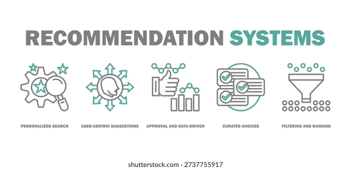

  

# 🛒 Product Recommendation System  
### From Data to Decisions — Personalized Recommendations at Scale

An end-to-end **E-commerce Product Recommendation System** that transforms raw user ratings into **meaningful, personalized product suggestions**.  
Built using **Item-Based Collaborative Filtering, SVD Matrix Factorization, and K-Means Clustering**, this project demonstrates a complete **real-world ML pipeline — from EDA to deployment**.

> 💡 Inspired by how platforms like Amazon and Netflix understand user preferences.

---

## 🌍 Why This Project?
Modern e-commerce platforms host **thousands of products**, making it difficult for users to find what they truly want.  
At the same time, user interaction data is often **sparse and noisy**.

This project tackles that challenge by:
- Understanding **user behavior**
- Discovering **hidden product relationships**
- Delivering **relevant recommendations in real time**

---

## 🎯 Project Highlights
- End-to-end machine learning workflow  
- Multiple recommendation strategies  
- Industry-standard evaluation metrics  
- Real-time web deployment  
- Clean and production-ready structure  

---

## 📊 Dataset Overview
- **Type:** User–Product Rating Data  
- **Attributes:**
  - `userId` – Unique user identifier  
  - `productId` – Unique product identifier  
  - `rating` – User’s product rating  
  - `timestamp` – Time of rating *(ignored)*  

The dataset captures **realistic user–product interactions**, making it suitable for recommendation modeling.

---

## 🔍 Exploratory Data Analysis (EDA)
EDA was performed to understand **user behavior and product popularity**.

Key insights:
- Rating distribution patterns  
- Most active users  
- Most rated products  
- High data sparsity (real-world challenge)  
- User–Item interaction heatmaps  

These insights guided **model selection and evaluation**.

---

## 🤖 Recommendation Models Implemented

### 1️⃣ Item-Based Collaborative Filtering
- Recommends products similar to those previously rated by the user  
- Stable, interpretable, and scalable approach  

### 2️⃣ SVD Matrix Factorization
- Learns latent user and product features  
- Predicts missing ratings effectively  
- Handles sparse data efficiently  

### 3️⃣ K-Means Clustering
- Segments users based on rating behavior  
- Groups products using latent features  
- Hierarchical clustering used for validation  

---

## 📈 Model Evaluation
To ensure meaningful recommendations, **ranking-based metrics** were used:
- **Precision@K**
- **Precision@10**
- **Hit@K**

These metrics focus on **top-N recommendation relevance**, similar to real production systems.

---

## 🚀 Deployment
The system is deployed as a **web application** using **Stream-Lit**.

### Application Workflow:
- User provides input  
- System processes historical rating data  
- Recommendation model generates predictions  
- Top-N product recommendations are displayed in real time  

🎥 **Demo Video:** Available in the `demo/` folder

---

## 🛠️ Tech Stack
- **Programming:** Python  
- **Data Processing:** Pandas, NumPy  
- **Machine Learning:** Scikit-learn  
- **Visualization:** Matplotlib, Seaborn  
- **Web Framework:** Flask  
- **Experimentation:** Jupyter Notebook  

---

## 📁 Project Structure
Product-Recommendation-System/
│
├── data/ # Dataset files
├── notebooks/ # Jupyter notebooks (EDA & modeling)
├── app/ # Flask web application
├── demo/ # Demo video
├── presentation/ # Project PPT
├── certificates/ # Course certificates
├── README.md # Project documentation
├── requirements.txt # Dependencies
└── .gitignore

---

## 🧠 Key Learnings
- Handling data sparsity and cold-start challenges  
- Comparing multiple recommendation approaches  
- Evaluating recommender systems using ranking metrics  
- Deploying ML models as real-world applications  

---
